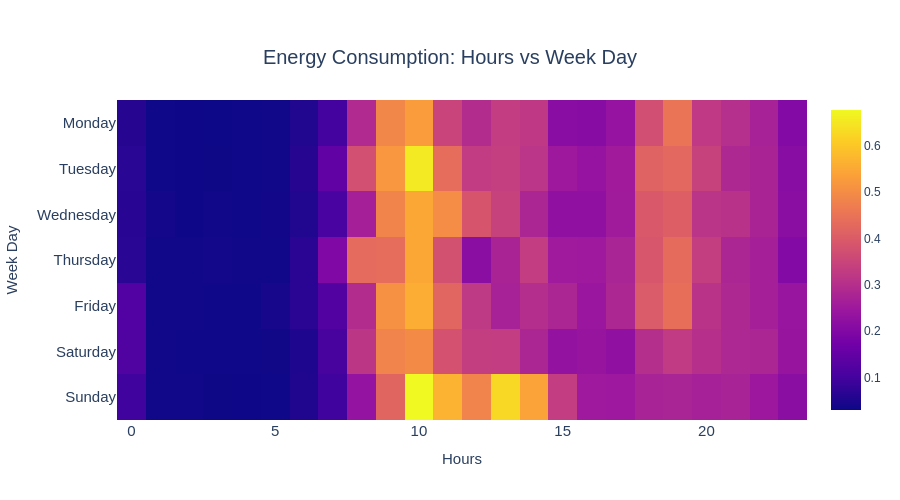
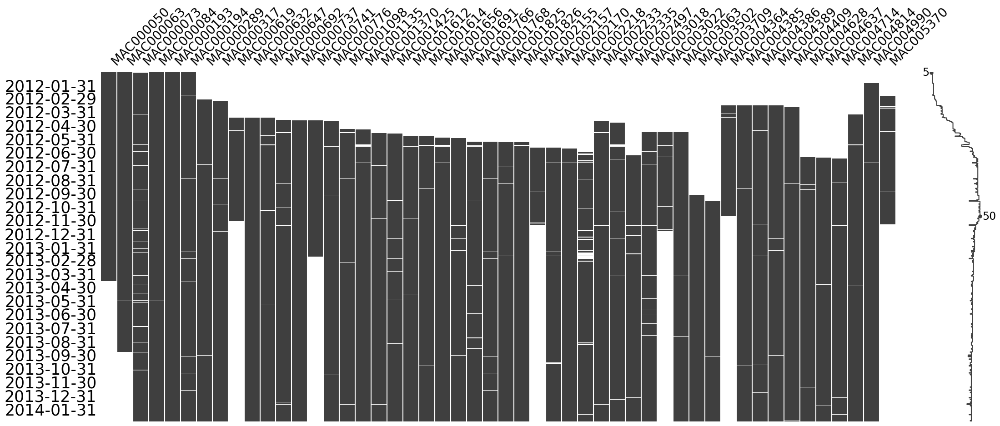
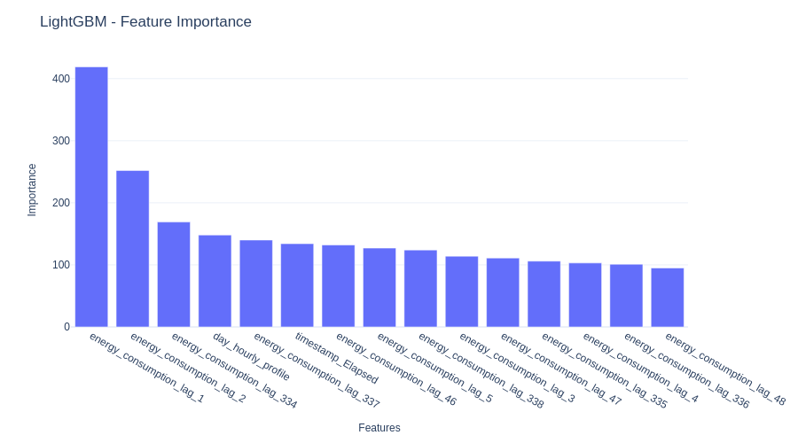
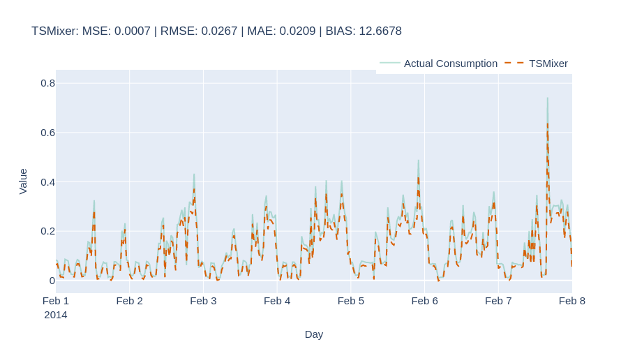

# Comparative Analysis of Forecasting Models for Household Energy Consumption

This project provides a comparison of forecasting models for household energy consumption using the London Smart Meters dataset. The research evaluates three distinct modeling paradigms: classical statistical methods (AutoETS, ARIMA), machine learning approaches (Lasso Regression, XGBoost Random Forest, LightGBM), and deep learning architectures (LSTM, TSMixer) to determine the most effective approach for residential energy consumption prediction.

## Feature

* Classical Time Series Models: Implementation of AutoETS and ARIMA models for baseline forecasting performance

* Machine Learning Models: Advanced regression techniques including Lasso Regression, XGBoost Random Forest, and LightGBM with feature engineering

* Deep Learning Models: State-of-the-art neural networks including LSTM and TSMixer for capturing complex temporal dependencies

* Data Processing: Automated data preparation pipeline with missing value imputation and feature engineering

* Exploratory Data Analysis: Extensive visualization tools for understanding energy consumption patterns, seasonality, and correlations

* Performance Evaluation: Multiple metrics including MSE, RMSE, MAE, and forecast bias analysis across all models

* Scalable Architecture: Designed to handle multiple households with different consumption patterns and socio-demographic characteristics

## Installation

1. Clone this repository

```
git clone <https://github.com/HienNguyen2311/london-energy-forecasting.git>
cd london_smart_meters
```

2. Create a virtual environment
3. Install required dependencies

```
pip install pandas numpy scikit-learn plotly missingno tqdm
pip install pmdarima statsforecast lightgbm xgboost
pip install darts torch
pip install jupyter ipywidgets
```
4. Download the London Smart Meters dataset from [Kaggle](https://www.kaggle.com/datasets/jeanmidev/smart-meters-in-london) and place it in the folder ```data```

## Usage

1. Run the data preparation pipeline ```jupyter notebook data_preparation.ipynb```
2. Explore the dataset characteristics ```jupyter notebook eda.ipynb```
3. Get the temporal and lag features ```jupyter notebook feature_engineering.ipynb```
4. Train classical models ```jupyter notebook baseline_models.ipynb```
5. Train machine learning models ```jupyter notebook ml_models.ipynb```
6. Train deep learning models ```jupyter notebook dl_models.ipynb```

## Data Sources

The London Smart Meters dataset from the UK Power Networks-led Low Carbon London project, which contains:
* Energy consumption readings for 5,567 London households
* Half-hourly measurements from November 2011 to February 2014
* Household metadata including socio-demographic classifications (ACORN groups)
* Weather data enrichment with temperature, humidity, and other meteorological variables
* UK bank holiday information

## Technologies Used

Python, Pandas, NumPy, Scikit-learn, Plotly, Pytorch, Statsforecast (classical time series forecasting models), XGBoost & LightGBM (gradient boosting frameworks) and Darts (time series forecasting library for deep learning models).

## Project Report

The project report provides detailed analysis of the research methodology, experimental setup, and results. Key findings include:

* Progressive Performance Improvement: Clear hierarchy showing classical methods < machine learning < deep learning models

* TSMixer Superiority: Achieved the best accuracy metrics (MSE: 0.0008) but with higher systematic bias

* Feature Engineering Impact: Machine learning models showed 56% improvement over classical methods through effective use of weather data and temporal features

* Practical Insights: Analysis of model behavior across different household consumption patterns and extreme events

The report includes visualizations, statistical analysis, and practical recommendations for energy forecasting applications in smart grid systems.

For more details, please refer to the project report, ```project_report.pdf```, included in this repository.

It should be noted that this project was largely adapted from the book "Modern Time Series Forecasting with Python - Second Edition" by Manu Joseph and Jeffrey Tackes. The automated data pipeline, exploratory analysis, visualizations, and model evaluation methodologies were primarily based on examples and approaches presented in this book.

## Screenshots


A calendar heatmap for energy consumption


Visualization of the missing data


Feature importance order


TSMixer forecast of MAC000061 (test set)

